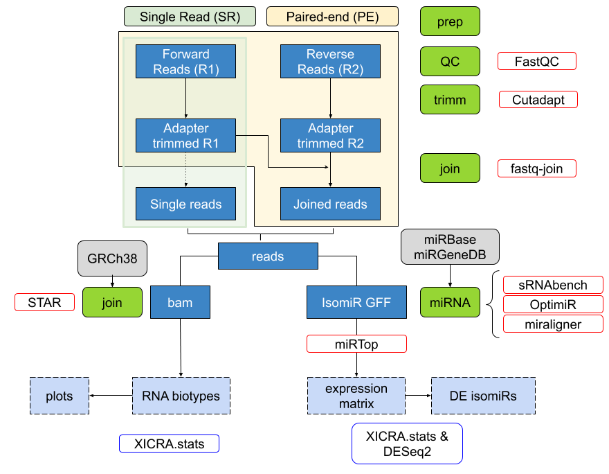

# XICRA: Small RNAseq pipeline for paired-end reads.

## Table of Contents

- [Decription](#description)
  * [Installation](#installation)
  * [XICRA.stats](#xicrastats)
  * [Etymology](#etymology)
- [Supplementary information](#supplementary-information)
- [Documentation](#documentation)
- [License](#license)
- [Citation](#citation)

## Description

XICRA is a python pipeline developed in multiple separated modules that it is designed to take paired end fastq reads, trim adapters and low-quality base pairs positions, and merge reads (R1 & R2) that overlap. Using joined reads it describes all major RNA biotypes present in the samples including miRNA and isomiRs, tRNA fragments (tRFs) and piwi associated RNAs (piRNAs). 

So far, XICRA produces a miRNA analysis at the isomiR level using joined reads, multiple software at the user selection and following a standardization procedure. 
Results are generated for each sample analyzed and summarized for all samples in a single expression matrix. This information can be processed at the miRNA or 
isomiR level (single sequence) but also summarizing for each isomiR variant type. This information can be easily accessed using the accompanied R package 
[XICRA.stats](https://github.com/HCGB-IGTP/XICRA.stats). Although the pipeline is designed to take paired-end reads, it also accepts single-end reads. 

See additional details on the code [here](https://github.com/HCGB-IGTP/XICRA/tree/master/XICRA_pip). The workflow of the pipeline is described in the following image. 

### Installation

XICRA will require python v3.6 and java (we tested in openjdk 14 2020-03-17).

The XICRA python pipeline is available in `pip` and also available using `conda`.

XICRA depends on multiple third party software that we have listed [here](https://github.com/HCGB-IGTP/XICRA/blob/master/XICRA_pip/README.md#dependencies).

We encourage you to install XICRA and all dependencies using the `conda` environment we created and following these instructions. 

Unfortunately, a couple of executables are not available neither as a `conda` or `pip` packages. These packages are `miraligner` and `sRNAbench`. We have generated a `shell` script to retrieve and include within your `conda environment`.

To create a new conda environment, install third party software, install XICRA and missing dependencies, do as follows:

```sh
## clone repo
git clone https://github.com/HCGB-IGTP/XICRA.git

## create conda environemt
conda env create -n XICRA -f XICRA_pip/devel/conda/environment.yml

## activate
conda activate XICRA

## install latest python code
pip install XICRA

## install missing software
sh XICRA_pip/XICRA/config/software/installer.sh
```

To check everything is fine, try executing the `config` module:
```sh
XICRA config
```

On the other hand, if you might have already installed software and available within your path, you might only need to install it using the [XICRA pip](https://pypi.org/project/XICRA/) module. We encourage you to installed it within a python environment. See as an example the description [here](https://github.com/HCGB-IGTP/XICRA/blob/master/XICRA_pip/README.md#python-environment)
 
### XICRA.stats

We additionally provide a supplementary R package for parsing and plotting some XICRA results. See additional details [here](https://github.com/HCGB-IGTP/XICRA.stats).

Install it in `R` using:

```R
# Install XICRA.stats version from GitHub:
# install.packages("devtools")
devtools::install_github("HCGB-IGTP/XICRA.stats")
```


### Etymology
XICRA means in Catalan "tassa petita, més aviat alta i estreta, emprada expressament per a prendre la xocolata desfeta o cafè. També és una unitat de mesura de volum per a líquids que es feia servir a Catalunya per a l'oli, vi, o llet. https://ca.wikipedia.org/wiki/Xicra"

## Supplementary Information
In this repository we provide supplementary information for the original paper describing the method. See additional details in folder BMC_bioinformatics_paper or [here](BMC_bioinformatics_paper/README.md)

## Documentation
For a full documentation and details visit Read the Docs site [here](https://xicra.readthedocs.io/). 

See a brief example on how to install and run XICRA [here](https://github.com/HCGB-IGTP/XICRA/tree/master/XICRA_pip#example)

## License 

MIT License

Copyright (c) 2020 HCGB-IGTP

See additional details [here](XICRA_pip/LICENSE)

Developed and maintained by Jose F. Sanchez-Herrero and Lauro Sumoy at HCGB-IGTP

http://www.germanstrias.org/technology-services/genomica-bioinformatica/

## Citation
Sanchez-Herrero et. al .... 2020


