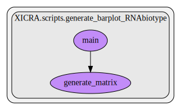

.. _RNAbiotype:

RNAbiotype
==========================================
This script contains several functions. Here we show a graph representation of the different functions and relationships among them:

.. automodule:: XICRA.scripts.RNAbiotype
    :members:
    :undoc-members:

