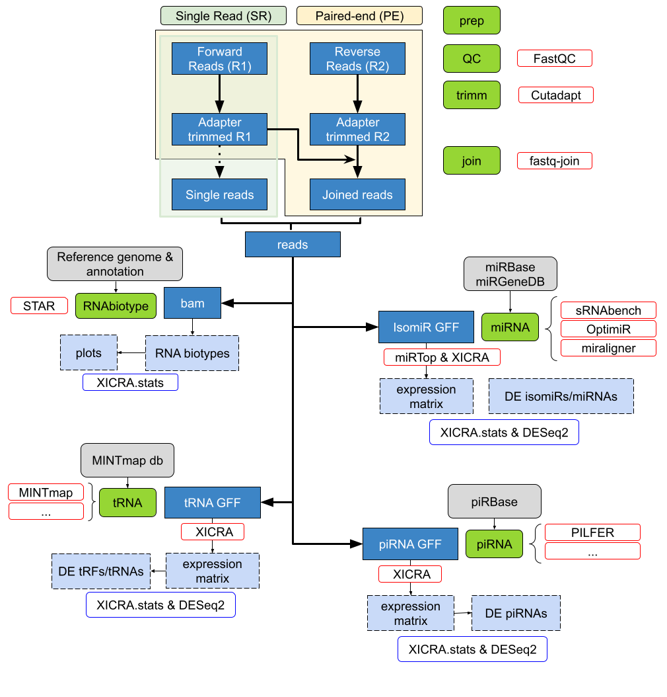

:orphan:

.. title:: XICRA documentation 

XICRA Documentation
*******************

.. only:: html 

    :Version: |version|
    :Date: |today|
    
Introduction
============

``XICRA`` is a pipeline that integrates multiple bioinformatic tools for the analysis of
paired-end or single end reads from small RNA-seq data. It describes all major RNA biotypes 
present in the samples including miRNA and isomiRs, tRNA fragments (tRFs) and piwi associated 
RNAs (piRNAs). Results are generated for each sample and summarized for all samples in a single 
expression matrix.

The pipeline is written in Python_ with a modular architecture and based on open-source software 
and databases engines. The design of this bioinformatic tool allows miRNA analysis at different 
levels.

Multiple tasks are performed by several modules including:
 - preparation of raw data
 - quality analysis and trimming of the adapters
 - merge reads (R1 & R2) that overlap
 - map reads to reference genome and annotation 
 - quantification of RNA types
 - miRNA and isomiR quantification (including the variant type)
 - preparation of results for integrative visualization
 
The tool uses the miRTop database and its notation to quantify and report the miRNAs present in each sample. 
With the resulting matrix for each sample the analysis can be performed at the miRNA, isomiR, or variant type 
level.

The ``XICRA`` documentation includes: 

.. #
.. TODO
.. #

- A :doc:`User's Guide <user_guide/user_guide_index>` to get started.
- An example :doc:`Tutorial <tutorial/tutorial_index>`.
- A :doc:`Quick Start Guide <user_guide/quickStart>`.
- A list of :doc:`user_guide/faqs`
- Some :doc:`developer Guidelines <devel/devel_index>` to contribute to the project.
- Additional :doc:`information <info/info_index>` of the ``XICRA`` project.
- A list of :doc:`Glossary <glossary/glossary_index>` terms.
- A list of :doc:`Bibliography <bib/zbib_index>`

.. ##################
.. _pipeline-scheme:
.. ##################

Pipeline Scheme
===============

Here we show the scheme of the ``XICRA`` bioinformatic tool. It is divided in six main actions:
   
   #. **Preparation of the input data**: preparation of the fastq files from a sequencing run.
   
   #. **Quality analysis**: with quality check programs attending the input provided.
   
   #. **Adapters trimming**: for each read the adapter sequences are filtered out.
   
   #. **Read joining**: joins sequencing reads (paired-end).
   
   #. **Mapping reads and feature counts**: generates a RNA biotype analysis, quantifying each RNA type present in the samples.
   
   #. **miRNA analysis**: generates a miRNA analysis, with isomiR quantification and variant type information.
   
This information can be easily accessed using the accompanied R package XICRA.stats_. Although the pipeline is designed to take
paired-end reads, it also accepts single-end reads.

Table of Contents
=================
.. toctree::
   :maxdepth: 4

   contents.rst
 
.. include:: links.inc
