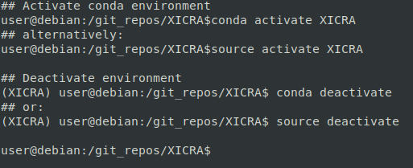

.. ################################################
.. _faqs:

.. #
.. TODO: complete this page:
.. #
Frequently Asked Questions (FAQs)
*********************************

.. contents::

This is a collection of FAQs for ``XICRA`` tutorial and interpretation of results. 

.. seealso::

    Please read further information on each section following the links provided or
    the main :ref:`User Guide for XICRA<users-guide-index>`.

Installation
============

- What is required for the installation?

In order to correctly install ``XICRA``, it is necessary to have python3 and 
python development and virtual environment libraries installed. See additional details 
in section :ref:`System requirements<system-requirements>`.

- The common errors during the installation are:

- How do I know the conda environment is activated?

Once you execute the activation of the environment, either using the script ``conda activate XICRA`` or 
by executing ``source activate XICRA``, you should see a tag in the command-line, ``(XICRA)``, prompt as shown in 
the following image.

Once you deactivate the environment this tag should disappear. 

Read additional details in Conda_ official documentation website.

.. #
.. TODO: add other blocs as:
.. Quality control
.. ===============
.. #

.. ######################
.. include:: ../links.inc
