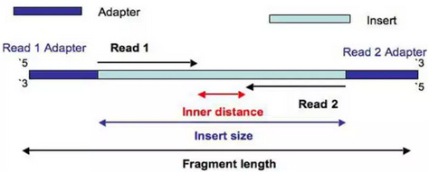
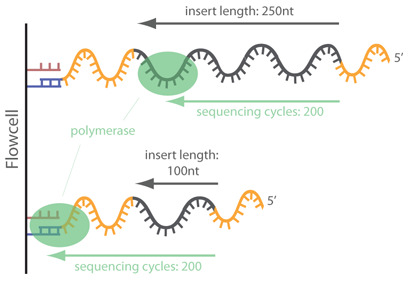

.. ############################
.. _trimm-description:
.. ############################

trimm
=====
This module trimms sequencing adapters that could be present in next generation sequencing 
files. Adapters have to be ligated to every single DNA molecule during library preparation. 
For Illumina short read sequencing, the corresponding protocols involve (in most cases) a 
fragmentation step, followed by the ligation of certain oligonucleotides to the 5’ and 
3’ ends. These 5' and 3' adapter sequences have important functions in Illumina sequencing, 
since they hold barcoding sequences, forward/reverse primers (for paired-end sequencing) 
and the important binding sequences for immobilizing the fragments to the flowcell and 
allowing bridge-amplification. 

   
In `Illumina sequencing`_, adapter sequences will only occur at the 3' end of the read and only 
if the read length is longer than the insert size:    

However, in the case of miRNAs, there will be adapter contamination in the 3’ reads but also
in the 5', due to their short nature.  As the adapters are synthetic they need to be removed.
Note that, the 3’ adapter of the R2 will be the same as the 5’ of R1, and the 5' of R2 will
be the same as the 3' of R1.

The adapter sequences must be introduced by the user to be trimmed, using the parameters -\ -adapters_a and 
-\ -adapters_A, for the adapters attached to the 3' of read 1 and read 2 correspondingly, see this :ref:`section<run-trimm>`. 
The process is done by the software Cutadapt_. 

.. ##################
.. _run-trimm:
.. ##################
How to run the trimm module
---------------------------
Executing the following:

.. code-block:: sh

   XICRA trimm -h

The different options and parameters for this module should appear in the command line prompt:

.. function:: Module XICRA trimm help

   :param -h --help: Show this help message and exit. 
   
.. function:: Module XICRA trimm Input/Output

   :param --input: Folder containing a project or reads, according to the mode selected. Files could be .fastq/.fq/ or fastq.gz/.fq.gz. See --help_format for additional details. REQUIRED.
   :param --output_folder: Output folder.
   :param --single_end: Single end files. Default mode is paired-end. Default OFF.
   :param --batch: Provide this option if input is a file containing multiple paths instead a path.      
   :param --in_sample: File containing a list of samples to include (one per line) from input folder(s). Default OFF.
   :param --ex_sample: File containing a list of samples to exclude (one per line) from input folder(s). Default OFF.
   :param --detached: Isolated mode. --input is a folder containing fastq reads. Provide a unique path o several using --batch option.
   :param --include_lane: Include the lane tag (*L00X*) in the sample identification. See -\ -help_format for additional details. Default OFF.
   :param --include_all: IInclude all file name characters in the sample identification. See -\ -help_format for additional details. Default OFF.
   
   :type input: string
   :type output_folder: string
   :type in_sample: string 
   :type ex_sample: string

.. function:: Module XICRA trimm options

   :param --adapters_a: Sequence of an adapter ligated to the 3' end (of read 1). See --help_trimm_adapters for further information.
   :param --adapters_A: Sequence of an adapter ligated to the 3' read in pair (of read 2). See -\ -help_trimm_adapters for further information.
   :param --extra: provide extra options for cutadapt trimming process. See -\ -help_trimm_adapters for further information.
   :param --skip_report: Do not report statistics using MultiQC report module. [Default OFF]. See details in --help_multiqc
   :param --threads: Number of CPUs to use. Default: 2. 
   
   :type threads: int 
   :type adapters_a: string 
   :type adapters_A: string
   :type extra: string
   
.. function:: Module XICRA trimm additional information
  
   :param --help_format: Show additional help on name format for files.
   :param --help_project: Show additional help on the project scheme.
   :param --help_trimm_adapters: Show additional help of the trimm module.
   :param --help_multiqc: Show additional help on the multiQC module.
   :param --debug: Show additional message for debugging purposes.

- For further information of the module functionallity, check this :doc:`page <../../api/modules/trimm>`.

Output of trimm for each sample
-------------------------------
After the ``trimm`` module excution, for each sample, a new fastq file is generated in the in the "trimm" folder of the sample 
with the same name as the raw one + "_trimm". 

It generates by default a MultiQC report in the folder "report/trimm", this report may be useful to detect outliers or 
if there are similar amounts of trimmed sequences for all samples. 

.. include:: ../../links.inc